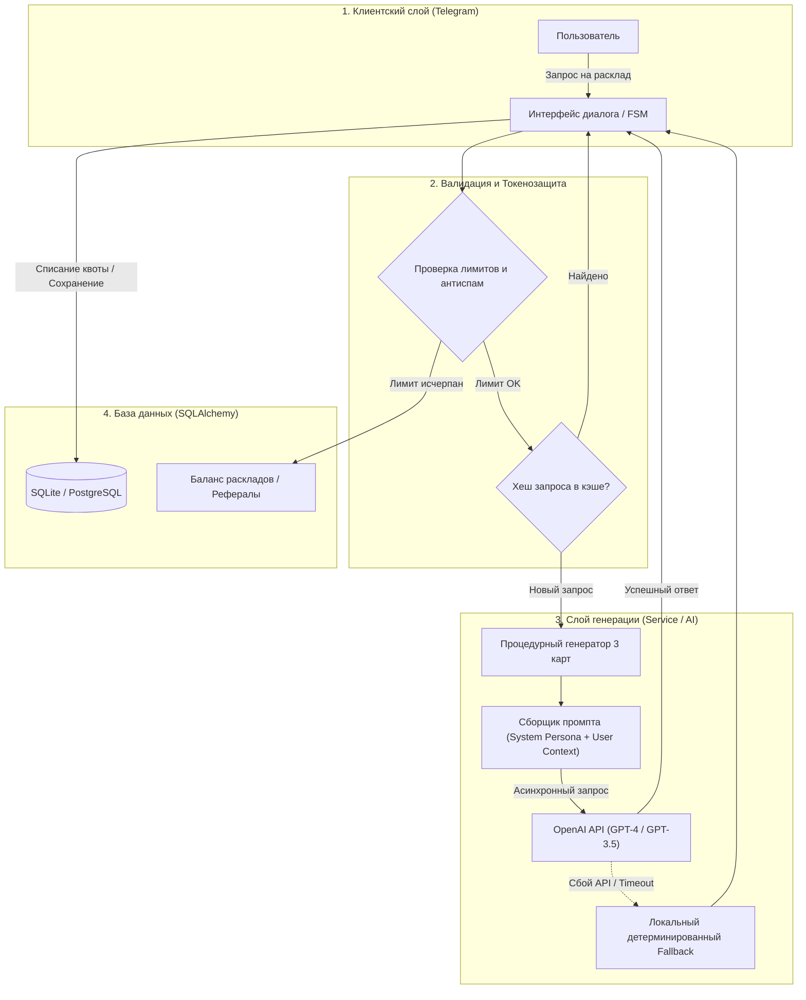

# 🔮 Tarot AI Assistant: Commercial Telegram Bot with OpenAI Integration

[](https://python.org)
[](https://docs.aiogram.dev)
[](https://openai.com)
[](https://docs.sqlalchemy.org)
[](https://docker.com)

> **Асинхронный Telegram-сервис для проведения персонализированных Таро-раскладов на базе OpenAI API с проработанной системой промпт-инжиниринга, токеносбережения и виральной реферальной механикой.**

Проект реализован как **коммерческий заказ** с передачей прав заказчику. Бот моделирует ролевую персону профессионального таролога, выполняет семантическую валидацию запроса пользователя, производит процедурную выборку 3 карт и генерирует структурированную интерпретацию расклада с пошаговой выдачей.

---

## 🏗️ Архитектура пайплайна генерации (AI Data Flow)

Система построена с акцентом на минимизацию расходов API (Token Cost Optimization) и отказоустойчивость:



---

## 🚀 Ключевые инженерные решения

* **Оптимизация расходов токенов (Token Guard):** Входящий текст валидируется до отправки в OpenAI API. Запросы фильтруются на спам, бессмысленный шум и неэтичный контент, экономя бюджет на вызовах LLM.
* **Ролевой промпт-инжиниринг:** Системный промпт изолирует модель в роли профессионального эзотерического аналитика, формируя структурированный ответ: метафорическое введение, индивидуальная трактовка каждой из 3 карт и итоговый синтез.
* **Fail-Safe механизм (Автономный Fallback):** В случае сетевого сбоя или исчерпания квот OpenAI сервис переключается на локальный процедурный генератор толкований, гарантируя, что пользователь всегда получит ответ.
* **Виральный механизм монетизации:** Встроенная реферальная система связывает привлечение новых пользователей с начислением дополнительных попыток раскладов в базе данных.
* **Clean Architecture & Async IO:** Четкое разделение слоев (`handlers` $\rightarrow$ `service` $\rightarrow$ `database`), асинхронный движок SQLAlchemy и контейнеризация через Docker Compose.

---

## 📂 Структура репозитория

```text
Taro_Cards/
├── bot/
│   ├── database/       # Модели SQLAlchemy, функции запросов и доступ к данным
│   │   ├── models.py   # Схема сущностей пользователей и транзакций
│   │   ├── requests.py # Асинхронные операции с базой
│   │   └── db_function.py
│   ├── handlers/       # Telegram-обработчики (команды, диалоги, рефералка)
│   │   ├── general.py  # Основные сценарии взаимодействия
│   │   └── utils.py    # Вспомогательные обработчики и фильтры
│   ├── service/        # Бизнес-логика и AI-пайплайн
│   │   └── generator.py# Интеграция с OpenAI, сборка промптов и fallback
│   ├── config.py       # Pydantic / Dotenv конфигурация
│   └── main.py         # Точка входа приложения
├── Dockerfile          # Сборка контейнера приложения
├── docker-compose.yml  # Оркестрация с персистентным томом данных
├── requirements.txt    # Зафиксированные зависимости
└── .env.example        # Шаблон конфигурации окружения
```

---

## ⚡ Быстрый старт (Deployment)

### 1. Клонирование и настройка окружения

```bash
git clone https://github.com/Curr3ncyV01D/Taro_Cards.git
cd Taro_Cards
cp .env.example .env
```

Заполните переменные в `.env`:
```env
BOT_TOKEN=your_telegram_bot_token
BOT_NAME=your_bot_username
API_TOKEN=your_openai_api_key
DATABASE_URL=sqlite+aiosqlite:///bot/database/database.db
```

### 2. Запуск через Docker Compose (Рекомендуется)

```bash
docker compose up -d --build
```

### 3. Локальный запуск без Docker

```bash
python -m venv venv
# Активация: venv\Scripts\activate (Windows) или source venv/bin/activate (Linux/macOS)
pip install -r requirements.txt
python -m bot.main
```

---

## 🛠️ Стек технологий

* **Фреймворк:** `Python 3.10+`, `aiogram 3.x`
* **Нейросети:** `OpenAI API (GPT-4 / GPT-3.5-Turbo)`
* **База данных:** `SQLAlchemy (Async Engine)`, `SQLite (aiosqlite)`
* **Контейнеризация:** `Docker`, `Docker Compose`
